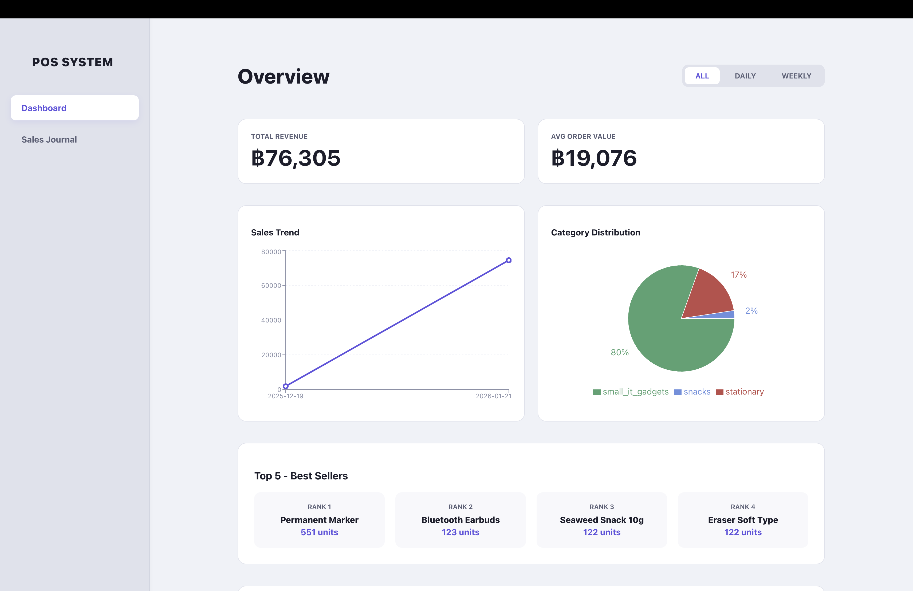
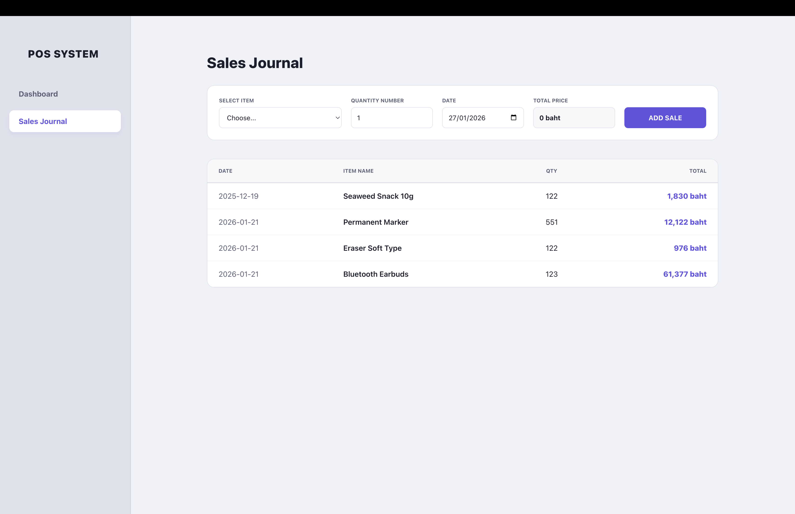

 # POS System - Web Application
**Member:** Jakawat Wongcharuen
            Wipob Jindapornsuk
            

---

## 📸 Screenshots

*Figure 1: Overview Dashboard with Sales Trends and Category Distribution*

*Figure 2: Sales Journal with real-time price calculation and transaction history*

## 🛠️ Technical Features
- **Data Persistence:** Uses `localStorage` to save transaction history across browser sessions.
- **Inventory Management:** Product data from JSON database.
- **Data Visualization:** Interactive Line and Pie charts.